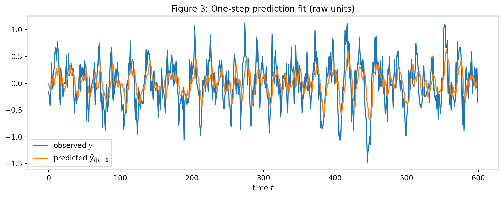
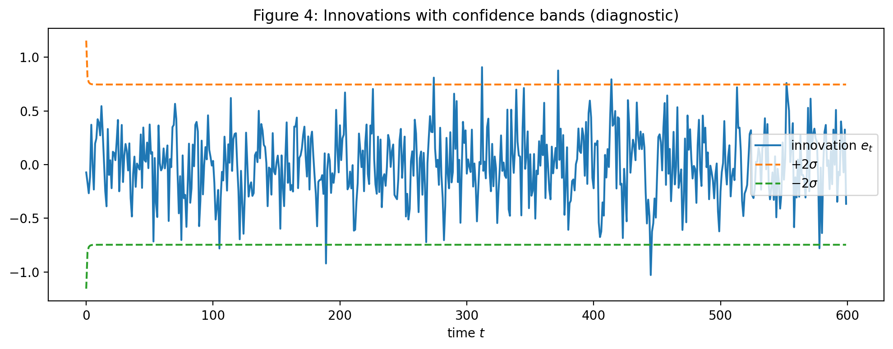
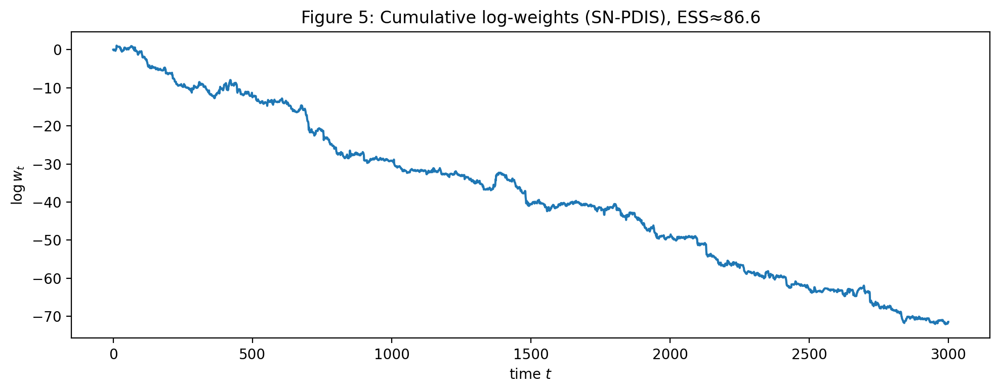
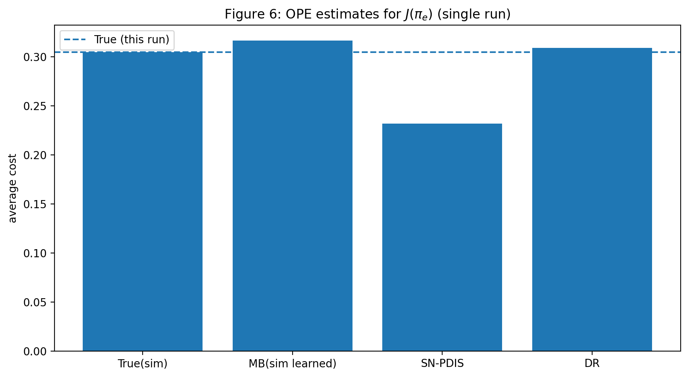
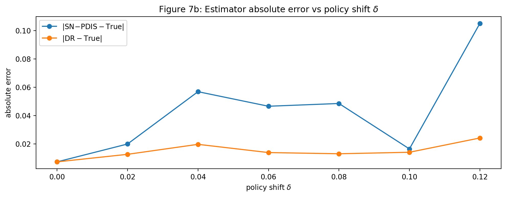
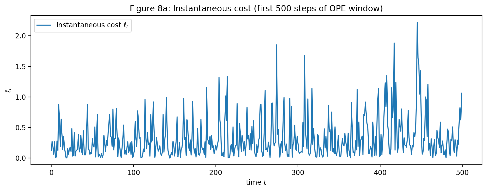
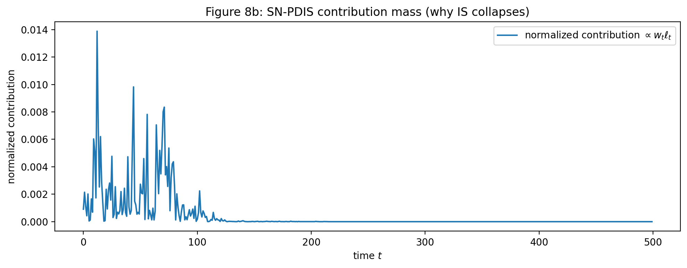
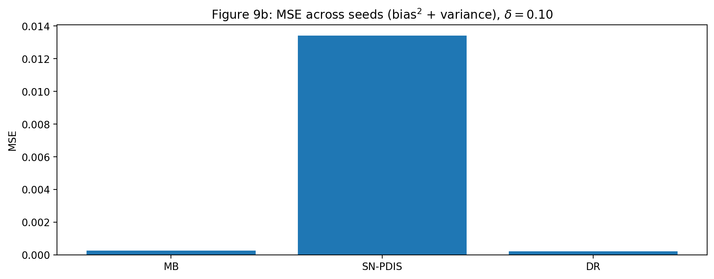

# Probabilistic Causal Off-Policy Evaluation for LQG Control

**Author**: Kasra Fallah  
**Affiliation**: PhD Student, Columbia University  
**Contact**: kasra.fallah@columbia.edu

---

## Overview

This repository contains the code and supplementary materials for the course project *"Probabilistic Causal Off-Policy Evaluation for LQG Control"*, developed as part of the PMML course taught by David Blei at Columbia University.

We explore how to evaluate a new control policy using only observational data collected under a different policy in a partially observed Linear Quadratic Gaussian (LQG) system. The project formulates off-policy evaluation (OPE) as a problem of probabilistic inference over latent dynamics and compares three estimators:

- **Model-Based (MB)**: Predict performance by simulating the learned model under the new policy.
- **Self-Normalized Importance Sampling (SN-PDIS)**: A policy-agnostic method that reweights observed costs using likelihood ratios.
- **Doubly Robust (DR)**: A hybrid method combining the two above to reduce bias and variance.

Our approach is motivated by safety-critical applications where deploying untested policies directly is risky.

---

## Simulation Results

<div align="center">

|  |  |
|:--:|:--:|
| *Fig 1: Prediction fit of EM-estimated model.* | *Fig 2: Innovation bands across time.* |

|  |  |
| *Fig 3: Log-weight growth in importance sampling.* | *Fig 4: Effective sample size vs policy shift.* |

|  |  |
| *Fig 5: OPE error of SN-PDIS, MB, and DR.* | *Fig 6: Error breakdown by policy gap.* |

|  |  |
| *Fig 7: Instantaneous cost under different estimators.* | *Fig 8: Concentration of SN-PDIS weights.* |

|  |  |
| *Fig 9: Variance across seeds.* | *Fig 10: MSE comparison across estimators.* |

</div>

---

## Getting Started

To reproduce the experiments:

```bash
git clone https://github.com/<your-username>/<your-repo-name>.git
cd <your-repo-name>
pip install -r requirements.txt
python run_experiments.py
